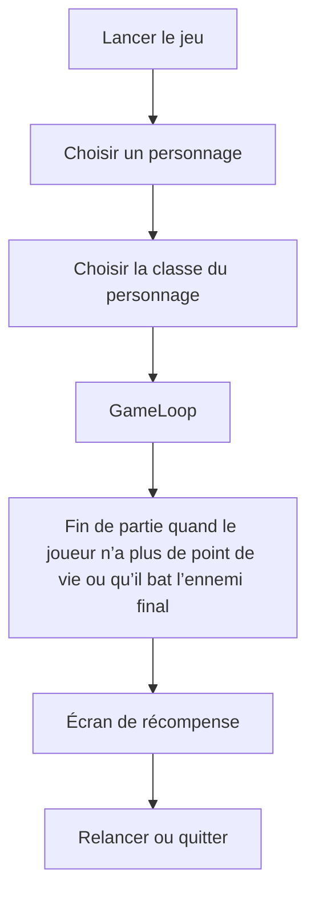
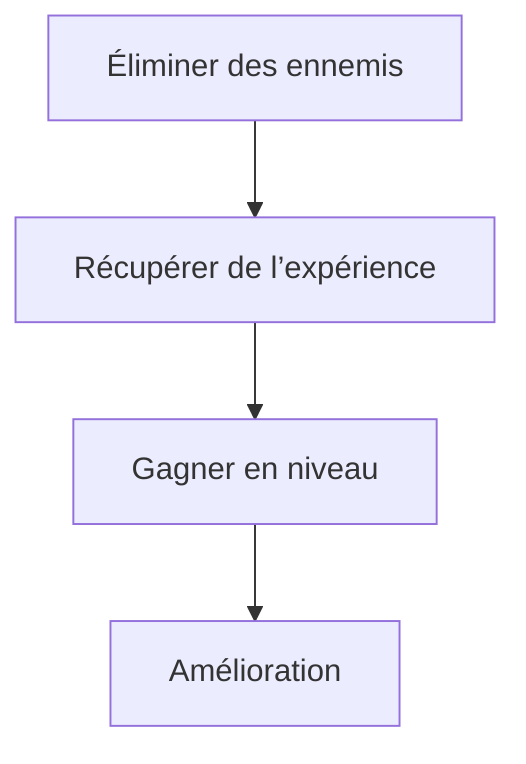

# Technical Design Document (TDD) pour C# Unity
## Document d'en tête 
- **Titre de Projet:** Endless War
- **Studio:** Axentra Games
- **Version:** 1.0
- **Date:** 2025-02-21
- **Auteurs:** [[GORSSE Camille](https://github.com/Jehyann)] [[MONTES Julen](https://github.com/JulenMYT)] [[DUBOIS Florentin](https://github.com/fduboisCG)] [[CARDOSO Florian](https://github.com/Portos2004)] [[FERRANDEZ-TARTARIN Noémie](https://github.com/Nonorrs)]
- **Contact:** [cgorsse@gaming.tech] [jmontes@gaming.tech] [fdubois@gaming.tech] [fcardoso@gaming.tech] [nferrandez-tartarin@gaming.tech]

## Historique des versions

| Date          | Version | Description                | Auteurs       |
|---------------|---------|----------------------------|--------------|
| 2025-02-21    | 1.0     | Technical Design Document | Axentra Games |

## Sommaire
1. [Introduction](#1-introduction)
2. [Tools, Environment, and Deployment](#2-tools-environment-and-deployment)
3. [System Architecture & Design](#3-system-architecture--design)

---
## 1. Introduction
### 1.1 Intention
Ce document décrit la conception technique du projet en C# Unity, détaillant son architecture, ses modules et son approche de développement piloté par les tests (TDD).

### 1.2 Étendue
- **Objectif :** Développer un jeu mobile pour le rendu, la physique, l'audio et la gestion des entrées.
- **Application :** Développement de jeux en temps réel et projets académiques.

### 1.3 Définitions, Acronymes et Abbréviations
- **TDD:** Test-Driven Development (Développement piloté par les tests)
- **API:** Application Programming Interface (Interface de programmation d'applications)
- **FPS:** Frames Per Second (Images par seconde)
- **IDE:** Integrated Development Environment (Environnement de développement intégré)

### 1.4 Références
- [Documentation Unity](https://docs.unity3d.com/2022.3/Documentation/Manual/index.html)
- [Documentation Visual Studio](https://learn.microsoft.com/fr-fr/visualstudio/windows/?view=vs-2022)
- [Documentation Github](https://docs.github.com/en)

### 1.5 Aperçu du document 
Ce TDD détaille la conception, les interactions des modules et les stratégies de test du jeu, garantissant ainsi la clarté de l'architecture de haut niveau aux détails d'implémentation de bas niveau.
---
## 2. Outils, environnement et déploiement
### 2.1 Outils de développement et IDE
- IDE recommandés: Visual Studio or VSCode.
- Éditeurs de code prenant en charge les fonctionnalités C#.
- Moteur: Unity 2022.3
### 2.2 Contrôle des versions
- Utilisez Github pour le contrôle de version.
- Adoptez une stratégie de branchement claire pour le développement de fonctionnalités.
### 2.3 Environnement de déploiement
- Plateformes cibles: Android, IOS.
- Système d’exploitation : Android 7.0 (Nougat) ou supérieur
- Processeur : Qualcomm Snapdragon 665 / Mediatek Helio P60 ou équivalent
- Nombre de cœurs CPU : 4 minimum
- Mémoire RAM : 3 Go
- GPU : Adreno 610 / Mali-G72 MP3 ou équivalent
- Stockage libre : 1,5 Go
- Écran : 720p minimum
- ---
## 3. Architecture et conception du système
### 3.1 Aperçu architectural
The engine employs a component-based architecture. Each module has well-defined interfaces, ensuring loose coupling and isolated development.
### 3.2 Répartition des modules
- **Rendering Module:** Handles shaders, textures, and communicates with the GPU.
- **Physics Module:** Implements collision detection and rigid body dynamics.
- **Audio Module:** Interfaces with audio libraries (e.g., OpenAL).
- **Input Module:** Abstracts device-specific input.
- **Game Logic Module:** Manages scripting and event coordination.
### 3.3 Diagrammes d'interaction
#### Main Loop

#### Game Loop

### 3.4 Décisions de conception et justification
- **Choix de langue :** C# pour Unity.
- **Choix du moteur :** Unity car plus performant pour produire un jeu mobile.
- **Modular Design:** Supports isolated testing and independent module development.
- **TDD:** Ensures high code quality and early bug detection.
---

