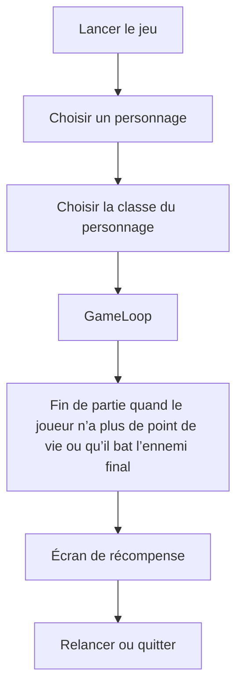
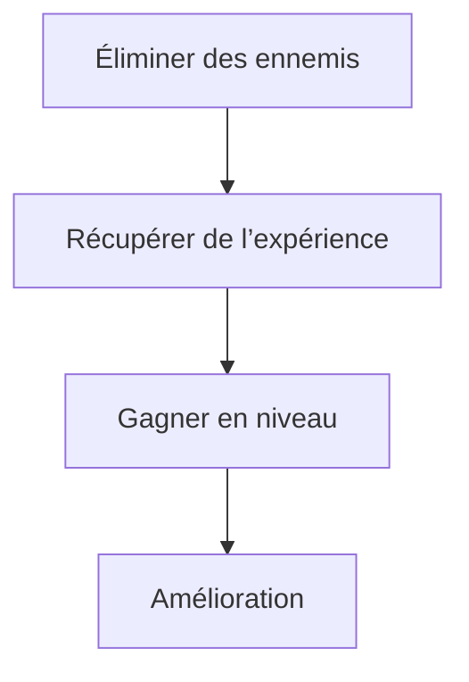

# Technical Design Document (TDD) pour C# Unity
## Document d'en tête 
- **Titre de Projet:** Endless War
- **Studio:** Axentra Games
- **Version:** 1.0
- **Date:** 2025-02-21
- **Auteurs:** [[GORSSE Camille](https://github.com/Jehyann)] [[MONTES Julen](https://github.com/JulenMYT)] [[DUBOIS Florentin](https://github.com/fduboisCG)] [[CARDOSO Florian](https://github.com/Portos2004)] [[FERRANDEZ-TARTARIN Noémie](https://github.com/Nonorrs)]
- **Contact:** [cgorsse@gaming.tech] [jmontes@gaming.tech] [fdubois@gaming.tech] [fcardoso@gaming.tech] [nferrandez-tartarin@gaming.tech]

## Historique des versions

| Date          | Version | Description                | Auteurs       |
|---------------|---------|----------------------------|--------------|
| 2025-02-21    | 1.0     | Technical Design Document | Axentra Games |

## Sommaire
1. [Introduction](#1-introduction)
2. [Outils, environnement et déploiement](#2-outils-environnement-et-déploiement)
3. [Architecture et conception du système](#3-architecture-et-conception-du-système)
4. [Performances et optimisation](#4-performances-et-optimisation)
5. [Gestion des Erreurs et Stabilité](#5-gestion-des-erreurs-et-stabilité)
6. [Interface Design](#6-interface-design)
7. [Features](#7-features)
8. [Technique](#8-technique)

---
## 1. Introduction
### 1.1 Intention
Ce document décrit la conception technique du projet en C# Unity, détaillant son architecture, ses modules et son approche de développement piloté par les tests (TDD).

### 1.2 Étendue
- **Objectif :** Développer un jeu mobile pour le rendu, la physique, l'audio et la gestion des entrées.
- **Application :** Développement de jeux en temps réel et projets académiques.

### 1.3 Définitions, Acronymes et Abbréviations
- **TDD:** Test-Driven Development (Développement piloté par les tests)
- **API:** Application Programming Interface (Interface de programmation d'applications)
- **FPS:** Frames Per Second (Images par seconde)
- **IDE:** Integrated Development Environment (Environnement de développement intégré)

### 1.4 Références
- [Documentation Unity](https://docs.unity3d.com/2022.3/Documentation/Manual/index.html)
- [Documentation Visual Studio](https://learn.microsoft.com/fr-fr/visualstudio/windows/?view=vs-2022)
- [Documentation Github](https://docs.github.com/en)

### 1.5 Aperçu du document 
Ce TDD détaille la conception, les interactions des modules et les stratégies de test du jeu, garantissant ainsi la clarté de l'architecture de haut niveau aux détails d'implémentation de bas niveau.
---
## 2. Outils, environnement et déploiement
### 2.1 Outils de développement et IDE
- Éditeurs de code prenant en charge les fonctionnalités C#.
- **IDE recommandés**: Visual Studio or VSCode.
- **Moteur de jeu**: Unity 2022.3
- **Processeur**: Intel Core i5 10ᵉ génération / AMD Ryzen 5 ou supérieur
- **Nombre de cœurs CPU**: 4 minimum (8 recommandé)
- **Mémoire RAM**: 8 Go minimum (16 Go recommandé)
- **Carte Graphique(GPU)**: Minimum : Nvidia GTX 1050 / AMD Radeon RX 560
- **Stockage**: 10 Go d’espace libre (SSD recommandé pour de meilleures performances)
- **Système d’exploitation**: Windows 10/11
### 2.2 Logiciels et API nécessaires
- **Moteur de jeu**: Unity (version LTS recommandée, ex. Unity 2022 LTS)
- **SDK Android**: Android SDK installé via Unity Hub
- **API graphique**: OpenGL ES 3.1 / Vulkan 1.1
- **Outil de développement**: Unity Remote
### 2.3 Contrôle des versions
- Utilisez Github pour le contrôle de version.
- Utilisation de Github Desktop pour gérer le projet plus facilement
- Adoptez une stratégie de branchement claire pour le développement de fonctionnalités.
### 2.4 Environnement de déploiement
- **Plateformes cibles**: Android, IOS.
- **Système d’exploitation**: Android 7.0 (Nougat) ou supérieur
- **Processeur**: Qualcomm Snapdragon 665 / Mediatek Helio P60 ou équivalent
- **Nombre de cœurs CPU**: 4 minimum
- **Mémoire RAM**: 3 Go
- **GPU**: Adreno 610 / Mali-G72 MP3 ou équivalent
- **Stockage libre**: 1,5 Go
- **Écran**: 720p minimum
- ---
## 3. Architecture et conception du système
### 3.1 Répartition des modules
- **Rendering Module:** Le moteur de rendu de Unity sera utilisé pour afficher les éléments du jeu.
- **Physics Module:** Le moteur physique de Unity sera utilisé pour gérer les collisions et les interactions entre les objets du jeu.
- **Audio Module:** Le jeu utilisera différents formats audio pour optimiser la qualité et la performance.
- **Input Module:** Le système d’inputs utilisé sera l’Input System de Unity, qui offre une gestion plus flexible et moderne des contrôles par rapport à l'ancien système (Input Manager). Il permet de mieux gérer les         entrées multi-dispositifs, comme l’écran tactile pour les mobiles, les manettes ou encore le clavier et la souris pour d’éventuelles adaptations futures.
### 3.2 Diagrammes d'interaction
#### Main Loop

#### Game Loop

### 3.3 Pourquoi Unity
- **Compatibilité multiplateforme**: Unity permet d’exporter facilement un jeu sur Android, iOS et d’autres plateformes sans devoir réécrire le code. Cela facilite le développement cross-platform, réduisant le temps et les coûts.
- **Optimisation des performances**: Unity propose des outils avancés comme Adaptive Performance pour ajuster la qualité graphique en fonction du matériel.
Le Scriptable Render Pipeline (URP) permet d’optimiser les graphismes pour les appareils mobiles.
Support de Vulkan et OpenGL ES 3.1, offrant de meilleures performances graphiques sur Android.
- **Taille et gestion des ressources**: Unity propose des compressions avancées (ex. ASTC, ETC2) pour réduire la taille du jeu sans trop impacter la qualité.
Le Addressables System optimise le chargement des assets pour éviter une consommation excessive de mémoire.
- **Large choix d’outils et de plugins**: Unity dispose du Unity Asset Store, qui propose des plugins pour l'UI, l'animation, l’IA et bien plus encore.
Intégration facile avec des SDK populaires comme Google Play Services, Firebase, AdMob et Facebook SDK pour la monétisation et l’analyse.
- **Facilité de développement**: C# est un langage accessible et performant pour les jeux mobiles.
Unity propose un éditeur intuitif avec du drag & drop et des outils comme Timeline pour l’animation et Cinemachine pour les caméras.
- **Support et communauté**: Grande communauté avec beaucoup de tutoriels et forums d’entraide.
Documentation bien fournie et mises à jour régulières avec les dernières technologies mobiles.
- **Gestion de la monétisation**: Unity Ads et Unity IAP (In-App Purchases) sont directement intégrés, facilitant la monétisation des jeux mobiles.
- ### 3.4 Pourquoi pas Unreal
Ce moteur est conçu pour les jeux avec un rendu ultra détaillé ce qui le rend moins optimisé pour le marché du jeu mobile à cause des performances plus basses des téléphones.

Exemple différence de graphisme sur un jeu (Infinity Nikki) développé sur Unreal entre le mobile et le pc:

---
## 4. Performances et optimisation
### 4.1 Objectifs de performance
Étant donné que le jeu est destiné aux appareils mobiles, plusieurs optimisations sont nécessaires pour garantir une fluidité à 60 FPS, une consommation minimale de batterie, et une stabilité sur une large gamme de téléphones (entrée de gamme à haut de gamme).
### 4.2 Optimisation Graphique
- **LOD (Level of Detail)**: Réduction des détails des modèles 3D lorsque la caméra est éloignée.
- **Sprites et UI optimisés**: Utilisation de Sprite Atlases pour limiter les appels de rendu.
- **Shaders mobiles**: Privilégier des shaders simples et optimisés pour réduire l’impact sur le GPU.
- **Pas d’ombres dynamiques sur mobile**: Utilisation de Lightmaps pour alléger le calcul d’éclairage.
- **Effets visuels légers**: Particle Systems limités en nombre et optimisés en durée de vie et nombre de particules.
### 4.3 Optimisation des Physiques et des Collisions
- Désactiver les collisions inutiles avec des Layers dédiés (éviter que les projectiles et ennemis testent les collisions entre eux).
- Rigidbody en mode Kinematic lorsque la physique n’est pas nécessaire (ex : ennemis qui se déplacent vers le joueur sans interaction avec le décor).
- Triggers plutôt que collisions physiques pour la détection des gemmes et attaques à distance.
### 4.4 Gestion des Spawns et Optimisation des Ennemis
- **Pooling des ennemis et projectiles**: nAu lieu d’instancier et détruire en boucle, on réutilise les objets via un Object Pool pour éviter le garbage collection fréquent.
- **Suppression des ennemis hors écran**: Désactivation automatique des ennemis trop éloignés du joueur pour alléger le CPU.
- **IA simplifiée**: Pas de pathfinding complexe, les ennemis se contentent d’un déplacement basique vers le joueur.
### 4.5 Optimisation des Scripts et du CPU
- **Moins d'Update()**: Éviter d’utiliser Update() dans chaque script. Favoriser les événements et coroutines pour exécuter du code seulement quand c’est nécessaire.
- **FixedUpdate pour la physique uniquement**: Réduire la fréquence de FixedUpdate (Time.fixedDeltaTime) pour économiser du CPU.
- **Utilisation de Jobs et Burst Compiler (optionnel)**: Si des calculs lourds sont nécessaires (ex : gestion massive des ennemis), utiliser Unity DOTS (Data-Oriented Tech Stack).
### 4.6 Optimisation Audio
- Limiter les AudioSources actives en simultané.
- **Compresser les sons**: Effets sonores en Vorbis (Ogg) au lieu de WAV pour réduire la taille.
- Musiques en MP3 avec un débit limité.
---
## 5. Gestion des Erreurs et Stabilité
Un jeu mobile doit être robuste et éviter les crashs ou bugs frustrants.
### 5.1 Gestion des Erreurs Critiques
- Try/Catch pour éviter les crashs imprévus, notamment lors des chargements de fichiers JSON.
- Vérification des données sauvegardées avant leur chargement (éviter les fichiers corrompus).
### 5.2 Gestion de la Mémoire et du Garbage Collector
- Pooling des objets pour éviter les allocations mémoire inutiles.
- Éviter les grosses allocations en temps réel :
- Privilégier les listes pré-allouées (List<T>.Capacity).
- Pas de string qui s’additionnent dans des boucles (StringBuilder plutôt que +=).
### 5.3 Gestion des Crashes et Reporting d'Erreurs
- Utilisation de Unity Cloud Diagnostics pour suivre les erreurs et crashs sur les téléphones des joueurs.
- Logs et fichiers de debug pour comprendre les causes de bugs récurrents.
### 5.4 Adaptabilité & Compatibilité Mobile
- Détection de la puissance du téléphone pour adapter les graphismes :Qualité basse sur téléphones bas de gamme (moins de particules, textures réduites).
- Qualité haute sur les modèles performants.
- Support du mode avion et perte de connexion :Vérification de l’état réseau si des fonctionnalités en ligne sont prévues (leaderboard, cloud save).

---
## 6. Interface Design
### 6.1 Interfaces internes
- Définissez des API claires entre les modules à l'aide de classes ou d'interfaces abstraites.
### 6.2 API externes et formats de fichiers
- Prise en charge des formats de fichiers standards: CS (scripts), FBX (models), JPEG  (textures), MP3 (audio).
### 6.3 Interface utilisateur (le cas échéant)
- Développez une interface utilisateur de débogage pour la surveillance et les diagnostics des performances en temps réel.
---
## 7. Features
### 7.1 3C
- Le jeu adopte une vue du dessus, avec une caméra qui suit le joueur en permanence, le maintenant au centre de l’écran.
- Au début de chaque partie, le joueur choisit:
  * **Son personnage**: Chaque personnage a ses propres statistiques de base.
  * **Sa classe**: Les classes influencent le style de jeu avec des compétences passives uniques et des bonus spécifiques.
Chaque classe affecte les compétences disponibles lors des montées de niveau.
### 7.2 Terrain
- Le terrain est une surface texturée sur laquelle le joueur et les ennemis peuvent se déplacer librement.
### 7.3 Joueur
- Le joueur évolue en 3D sur un vaste terrain et peut se déplacer librement. Son attaque est automatique, au corps à corps ou à distance selon son équipement.
- Pour se déplacer, l’utilisateur pose son doigt sur l’écran, faisant apparaître un stick virtuel qu’il peut bouger à sa guise.
- En éliminant des ennemis, le joueur gagne de l’expérience. À chaque montée de niveau, il peut choisir parmi une liste de compétences, lui permettant d’améliorer ses statistiques ou d’obtenir de nouvelles armes pour diversifier son arsenal.
- La partie prend fin si les points de vie du joueur tombent à zéro.
### 7.4 Ennemis
- Les ennemis en 3D se déplacent vers le joueur et lui infligent des dégâts au contact. Leur comportement est simple et prévisible, mais leur nombre croissant les rend rapidement menaçants. Leur résistance augmente progressivement, rendant leur élimination de plus en plus difficile.
- Ils apparaissent à une certaine distance autour du joueur, tentant de l’encercler pour limiter ses possibilités d’évasion.
- À mesure que le joueur progresse, le nombre d’ennemis augmente pour maintenir un niveau de défi constant.
- Périodiquement, un boss redoutable fait son apparition, intensifiant le combat et représentant une menace plus grande.
- Lorsqu’ils sont vaincus, les ennemis laissent derrière eux une gemme d’expérience. La valeur de cette gemme dépend de la dangerosité de l’ennemi éliminé.
### 7.5 HUD
- Barre de vie : Située sous le joueur, elle indique son état de santé. Si elle se vide, il perd la partie et doit recommencer.
- Barre d’expérience : Affichée en haut de l’écran, elle permet de visualiser la progression jusqu’au prochain niveau.
## 8. Technique
### 8.1 Inputs
- Le système d’inputs utilisé sera l’Input System de Unity, qui offre une gestion plus flexible et moderne des contrôles par rapport à l'ancien système (Input Manager). Il permet de mieux gérer les entrées multi-dispositifs, comme l’écran tactile pour les mobiles, les manettes ou encore le clavier et la souris pour d’éventuelles adaptations futures.
- Dans ce jeu, l’Input System sera principalement utilisé pour :
    * Gérer le stick virtuel qui permet au joueur de se déplacer en touchant l’écran.
    * Détecter les interactions et les éventuels menus du jeu.
### 8.2 Audio
- Le jeu utilisera différents formats audio pour optimiser la qualité et la performance:
    * Les fichiers .wav seront employés pour les effets sonores et les bruitages. Ce format est non compressé, ce qui garantit une haute qualité sonore, idéale pour les sons courts comme les impacts, les coups ou les bruits d’ennemis.
    * Les fichiers .mp3 seront utilisés pour la musique du jeu, car ce format compressé permet de réduire la taille des fichiers tout en conservant une bonne qualité audio.
- Unity intégrera ces fichiers via AudioSource et AudioClip, avec un Audio Mixer pour ajuster les volumes des différents éléments sonores (musique, effets, interface).
### 8.3 Physique
- Le moteur physique de Unity sera utilisé pour gérer les collisions et les interactions entre les objets du jeu.
- **Rigidbody**: Chaque entité dynamique (joueur, ennemis, projectiles) possédera un Rigidbody pour être affectée par la physique du jeu.
- **Colliders**: Les objets auront des colliders adaptés (BoxCollider, SphereCollider, CapsuleCollider) afin de détecter les contacts et déclencher les interactions (dégâts, ramassage de gemmes).
- **Layers & Triggers**: Une optimisation sera faite en définissant des layers spécifiques pour limiter les calculs de collisions inutiles et en utilisant des triggers pour les interactions (comme ramasser une gemme sans collision physique réelle).
### 8.4 Rendering
- Le moteur de rendu de Unity sera utilisé pour afficher les éléments du jeu:
- **Modèles 3D**: Le joueur, les ennemis et le décor seront modélisés en 3D et rendus en temps réel.
- **Sprites & UI**: Les éléments de l’interface utilisateur (HUD, barres de vie et d’expérience, menus) seront affichés via le système UI Canvas de Unity.
- **Éclairage**: Un éclairage simple sera utilisé pour optimiser les performances sur mobile, avec éventuellement des Lightmaps pour pré-calculer certaines ombres et alléger le rendu.
- **Effets visuels**: Des Particle Systems pourront être ajoutés pour des effets comme des explosions, des impacts ou des auras d’expérience autour des gemmes.
### 8.5 Shader
- A compléter
### 8.6 Sauvegarde des Scores & Progression
- PlayerPrefs pour stocker le meilleur score et les paramètres de jeu.
- Fichiers JSON pour sauvegarder: 
    * Personnage et classe choisis.
    * Niveau atteint, compétences débloquées.
    * Meilleur score et statistiques de partie.
- Cloud Save (optionnel) avec Google Play Games ou iCloud pour sauvegarder en ligne
